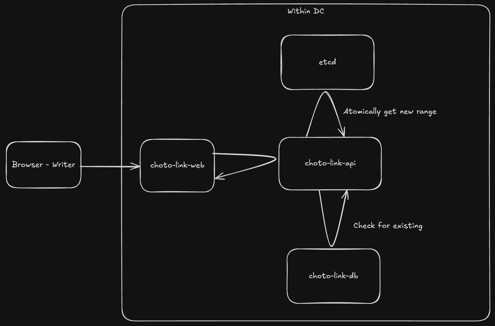

# choto-link-api

> टाइम छैन, लिङ्क छोटो बना!

## Functional Requirements

## Major Requirements

1. Users should be able to generate shortened urls for a url.
2. Users should be able to enter the shortened url and get redirected to the original url.

## Corner Case Requirements

1. Short Url Uniqueness Guarantee
   1. A short url should only be redirected to a single long url and should not be overwritten with another URL ever. (Exhaustive Property)
   2. Same URL shortened by multiple users should have different short url. However, multiple "shorten" requests by the same user should provide the same shortened url. (Tracking purpose)
2. Short Url Redirection Guarantee
   1. The short url will ALWAYS be redirected to the original long url and will never expire.
   2. Even though the redirection is permanent, the redirection request should always be sent to our servers.

## Architecture

